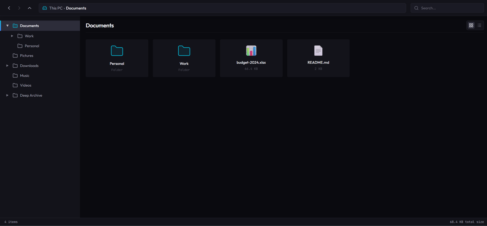

# File Explorer

A full-stack file explorer application built as a technical assessment. Features a tree-based folder navigation sidebar and a paginated content panel with infinite scroll, backed by a Hexagonal Architecture API.



---

## Tech Stack

| Layer            | Technology                                                 |
| ---------------- | ---------------------------------------------------------- |
| **Frontend**     | Vue 3 (Composition API), Vue Router, Vite, Tailwind CSS v4 |
| **Backend**      | ElysiaJS (Bun runtime), Drizzle ORM                        |
| **Database**     | PostgreSQL                                                 |
| **Monorepo**     | Bun Workspaces                                             |
| **Testing (BE)** | `bun:test` — Unit + Integration                            |
| **Testing (FE)** | Vitest + Vue Test Utils + jsdom                            |

---

## Project Structure

```
.
├── packages/
│   ├── backend/          # Hexagonal Architecture API (ElysiaJS)
│   │   └── src/
│   │       ├── adapters/
│   │       │   ├── driven/       # Outbound: PostgreSQL repository
│   │       │   └── driving/      # Inbound: REST controllers
│   │       ├── domain/
│   │       │   ├── errors/       # Domain error classes
│   │       │   ├── models/       # Item, FolderContent, ItemTree types
│   │       │   ├── ports/        # Repository & Service interfaces
│   │       │   └── services/     # Core business logic
│   │       ├── config/           # DB connection & env validation
│   │       └── plugins/          # Elysia error handler plugin
│   │
│   ├── frontend/         # Vue 3 SPA
│   │   └── src/
│   │       ├── components/       # Atomic UI components
│   │       ├── composables/      # useExplorer, useSearch
│   │       ├── router/           # Vue Router (path-based navigation)
│   │       ├── services/         # API client (itemApi)
│   │       └── utils/            # sortItems helper
│   │
│   └── shared/           # Shared TypeScript types (Item, TreeNode, etc.)
│
├── docker-compose.yml    # PostgreSQL container
├── .env.example          # Environment variable template
└── bun.lock
```

---

## Getting Started

### Prerequisites

- [Bun](https://bun.sh/) `>= 1.0`
- [Docker](https://www.docker.com/) (for PostgreSQL)

### 1. Clone & Install

```bash
git clone <repo-url>
cd tht-full-stack-developer-infokes
bun install
```

### 2. Configure Environment

```bash
cp .env.example .env
```

Edit `.env` if needed. The defaults work out of the box with Docker Compose.

### 3. Start the Database

```bash
docker compose up -d
```

### 4. Run Migrations & Seed

```bash
cd packages/backend
bun run db:migrate
bun run db:seed
```

The seed generates ~400 items across a realistic folder hierarchy (Documents, Downloads, Pictures, etc.) including deeply nested subfolders.

### 5. Run the Application

In separate terminals:

```bash
# Terminal 1 — Backend API (http://localhost:3000)
cd packages/backend
bun run dev

# Terminal 2 — Frontend (http://localhost:5173)
cd packages/frontend
bun dev
```

---

## API Reference

Base URL: `http://localhost:3000/api/v1`

| Method | Endpoint                                   | Description                                   |
| ------ | ------------------------------------------ | --------------------------------------------- |
| `GET`  | `/items/tree`                              | Get full folder tree for the sidebar          |
| `GET`  | `/items/contents?folderId=&limit=&offset=` | Get paginated root-level contents             |
| `GET`  | `/items/by-path?path=&limit=&offset=`      | Get paginated contents by folder path string  |
| `GET`  | `/items/search?q=&path=`                   | Search items by name, scoped to optional path |
| `POST` | `/items`                                   | Create a new file or folder                   |

### Pagination

All content endpoints support `limit` (default 50) and `offset` for cursor-based infinite scroll. The response includes `totalElements` to indicate whether more pages are available.

```jsonc
// GET /api/v1/items/by-path?path=Documents&limit=50&offset=0
{
  "folder": { "id": "...", "name": "Documents", ... },
  "children": [ ... ],  // up to `limit` items, folders first
  "totalElements": 76   // total count for hasMore computation
}
```

---

## Running Tests

### Backend (bun:test)

```bash
cd packages/backend
bun run test
```

**Coverage:**

- **Unit Tests** — `item.service.test.ts`: Pure domain logic with mocked repository (validation, tree-building, path resolution)
- **Integration Tests** — `item.repository.test.ts`: Real PostgreSQL queries verifying pagination, folder-first ordering (SQL CASE), and CRUD isolation with automatic cleanup

### Frontend (Vitest)

```bash
cd packages/frontend
bun run test
```

**Coverage:**

- **Composable Tests** — `useExplorer.test.ts`: Navigation mechanics (`selectFolder`, `goUp`), loading state transitions, loadMoreChildren guard logic — all with mocked API and router
- **Component Tests** — `ContentPanel.test.ts`: Verifies Skeleton renders when `isChildrenLoading` is true, using jsdom with mocked `IntersectionObserver`

---

## Architecture Notes

### Backend — Hexagonal Architecture

The backend strictly enforces separation through ports and adapters:

```
HTTP Request
    ↓
[Driving Adapter] item.controller.ts   ← Elysia routes, TypeBox validation
    ↓
[Domain Port]     ItemService           ← Interface contract
    ↓
[Domain Service]  ItemServiceImpl       ← Business logic (DB-agnostic)
    ↓
[Domain Port]     ItemRepository        ← Interface contract
    ↓
[Driven Adapter]  PostgresItemRepository ← Drizzle ORM + PostgreSQL
```

Domain errors (`NotFoundError`, `ValidationError`, `ConflictError`) live in `domain/errors/` — not in models — keeping data entities clean.

### Frontend — Composable-Driven State

Navigation state is managed entirely in `useExplorer.ts` as module-level reactive refs, shared across components without Pinia/Vuex. URL state is the source of truth — router path changes trigger API fetches via `router.afterEach`.

Infinite scroll uses a `watch(scrollSentinel)` pattern rather than `onMounted` + `setTimeout`, ensuring the `IntersectionObserver` only attaches after items actually render into the DOM.

### Folder-First Ordering

All queries use an explicit SQL `CASE` expression instead of `ORDER BY type DESC` to guarantee deterministic folder-before-file ordering across PostgreSQL collations:

```sql
ORDER BY CASE WHEN type = 'folder' THEN 0 ELSE 1 END ASC, sort_order, name
```

---

## Database Scripts

All scripts run from `packages/backend` and require `.env` to be configured:

```bash
bun run db:generate   # Generate Drizzle migration files
bun run db:migrate    # Apply migrations to DB
bun run db:flush      # Delete all data
bun run db:seed       # Seed with realistic test data (~400 items)
bun run db:reset      # migrate + flush + seed in one command
```
